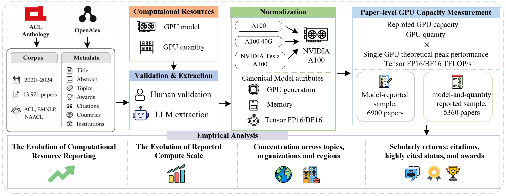

# Do More Computational Resources Translate into Greater Scholarly Recognition?
Evidence from 13,921 NLP Conference Papers

This repository accompanies the paper **"Do More Computational Resources Translate into Greater Scholarly Recognition? Evidence from 13,921 NLP Conference Papers."** It contains the released analysis data, figure-generation scripts, and processing code used in the study.

## Contents

- `analysis/`: paper-level datasets, analysis scripts, figures, and report notes.
- `code/`: metadata, PDF parsing, affiliation extraction, and compute-resource extraction pipeline. See `code/README.md` for details.
- `assets/`: README and repository media.

## Reproduction

Use `analysis/data/` as the main released dataset. Manuscript analyses are organized by section under `analysis/`, with scripts and outputs kept together in each subfolder. For raw PDF/metadata processing and GPU extraction workflows, see `code/README.md`.
