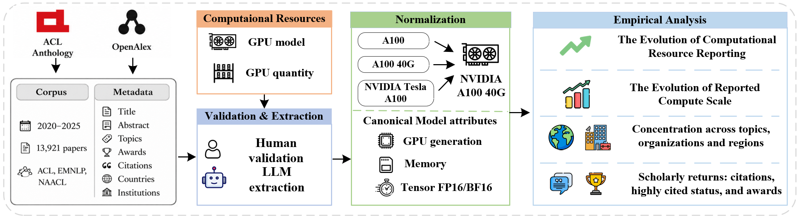

# More Computational Resources Do Not Ensure Higher Scholarly Impact: Evidence from Leading NLP Conference Papers



Official result-reproduction repository for:

> **More Computational Resources Do Not Ensure Higher Scholarly Impact: Evidence from Leading NLP Conference Papers**  
> Shuai Chen, Tong Bao, Jitong Peng, and Chengzhi Zhang

------

## Results at a glance

| Result | Paper value |
|---|---:|
| Full paper corpus | 13,921 |
| Papers reporting a GPU model | 6,900 (49.6%) |
| Strict model-and-count sample | 5,360 (38.5%) |
| Primary adjusted citation-percentile association per 10x capacity | +3.52 pp |
| Incremental model fit for the primary capacity specification | ΔR² = 0.0042 |
| Citation / award model samples | 2,194 / 5,357 |

## Repository structure

```text
data/analysis_ready/   
code/                  One-command runner, verifier, and result contracts
results/               Paper-first sections with scripts and frozen references
  01_sample/
  02_reporting/
  03_gpu_scale/
  04_contexts/
  05_scholarly_impact/
```

## Reproduce all results

Install [uv](https://docs.astral.sh/uv/), then run from the repository root:

```bash
uv sync
uv run python code/run_all.py
uv run python code/verify.py
```

For a fast smoke run:

```bash
uv run python code/run_all.py --quick
uv run python code/verify.py --quick
```

## License

Code is released under the Apache License 2.0; see [`LICENSE`](LICENSE).
Third-party source records retain their original terms and are not relicensed by
this repository.

## Citation

Please cite the paper and this release.
